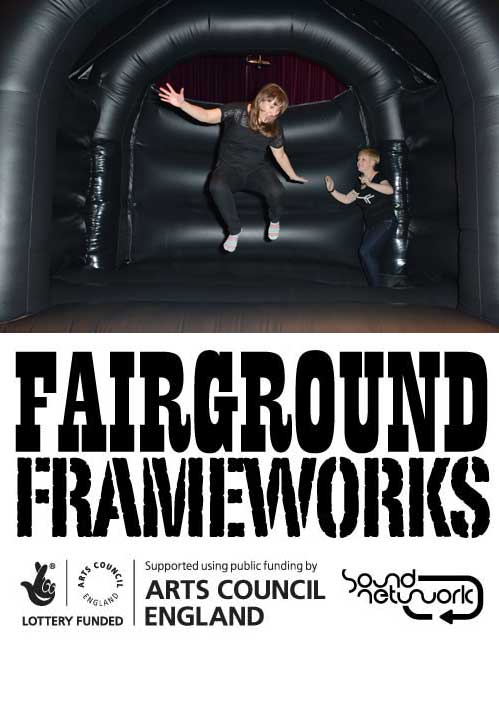
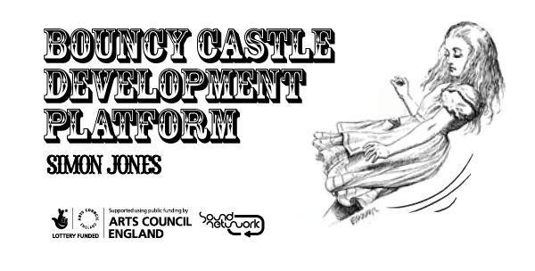
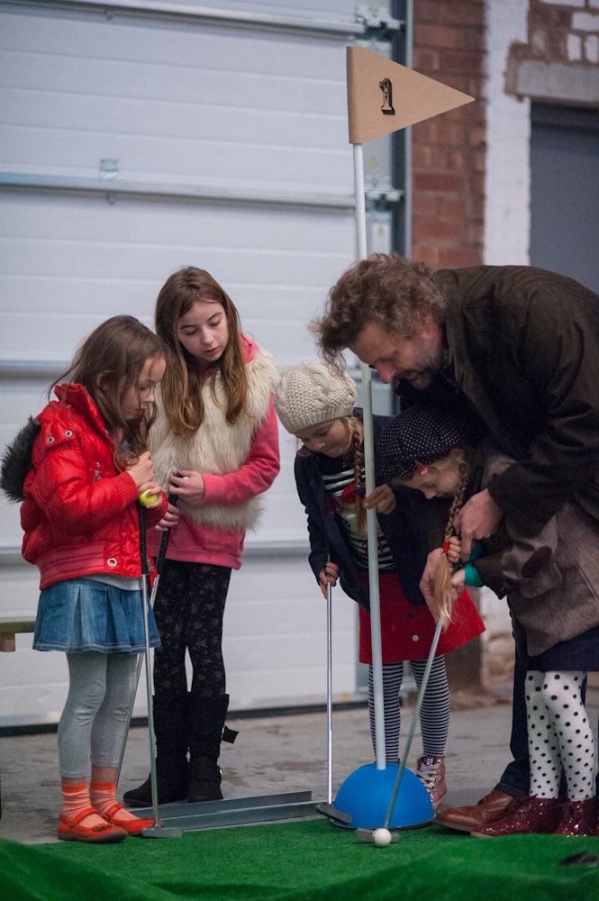
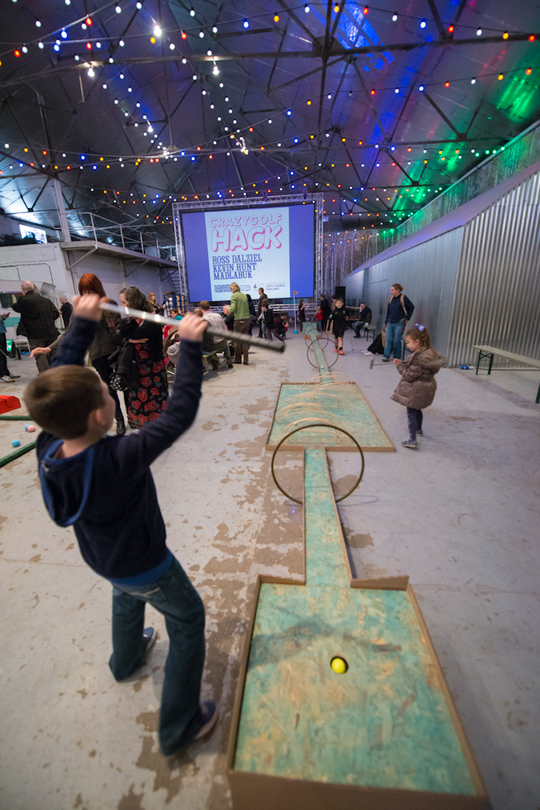
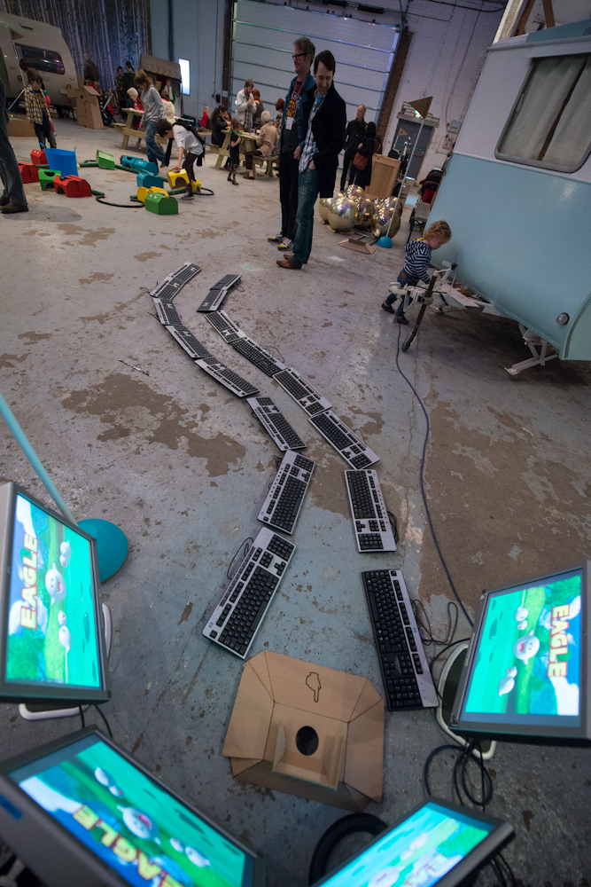
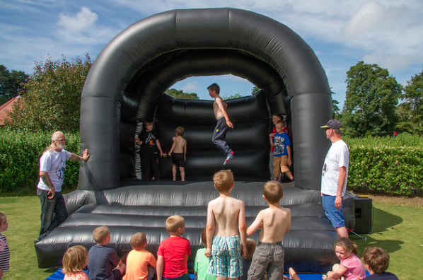
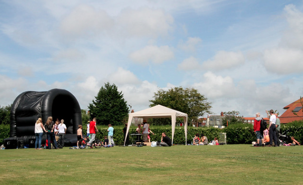
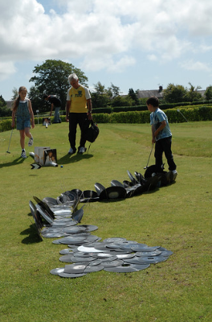
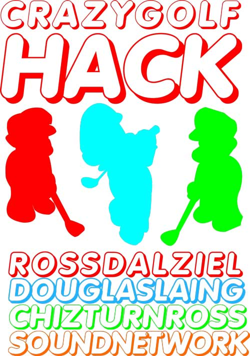



# Fairground Frameworks

Fairground Frameworks, was a body of work curated by Ross Dalziel of  SoundNetwork that supported projects by artists influenced by public play including Ross Dalziel, Simon Jones, Madlab & HacMan Manchester, Kevin Hunt and builds on Ross & SoundNetwork's past public play and research and Development projects **Bouncy Castle Development Platform** and **Crazy Golf Hack** first commissioned by [FON Festival](http://fonfestival.org) and touring the North West with
partners Liverpool Biennial, Everton Kite Festival, FACT and TATE Liverpool.  

It developed one of the key approaches to [Domestic Science](https://domesticscience.org.uk) using intuitive Play as a familiar social format (everyone 'knows' the social rules of mini-golf, ping pong or bouncy castles) for knowledge exchange. Originally it was a space for artists to do research and development in public and to challenge artists to work with new audiences and to take sound art out of controlled gallery and individual listening spaces. Domestic Science still use this approach to open up spaces and hybrid forums to discuss science and technology.

Fairground Frameworks, a playful reference to popular screen based interaction programming language, OpenFrameworks, featured various iterations and installations of temporary Crazy golf courses by a diverse group of artists from the North West and includes Simon Jones bespoke bouncy castle augmented into a haptic low frequency sound installation.

It also aimed to not only take sound art out of the gallery, but placed coding practices in live family friendly environments.

From SoundNetwork's perspective, it supported their remit to foster playful enagaging spaces for artists to make new work and extend the scopes and contexts for interdisciplinary sound based art practice; experiment, prototype and then sustainably tour and build on systems that support their practice technically and financially and show their work to diverse publics.

Originally Ross & SoundNetwork's response to FON Festival's invitation to make work about their public park was to invite artists unused to working with technology to develop temporary crazy golf holes 'hacking' an existing well used pitch-and-putt mini-golf green which would stealthily enable artists to work with non-screen based technology 'physical computing' and public intaeraction design but in response to their environment.

It led to developing the Fairground Framework tour supported by Arts Council England and a celebratory project for [FACT](https://fact.co.uk) which you can see below to open up the project to more artists in the North West.

 

<!--
<iframe src="https://player.vimeo.com/video/43024935" style="position:absolute;top:0;left:0;width:100%;height:100%;" frameborder="0" allow="autoplay; fullscreen" allowfullscreen></iframe>
-->

<a href="https://vimeo.com/43024935">Crazy Golf Hack by Sound Network and invited artists at FON 2011</a> from <a href="https://vimeo.com/user4699794">Octopus Collective</a> on <a href="https://vimeo.com">Vimeo</a>.

<!--
<iframe src="https://player.vimeo.com/video/62172831" style="position:absolute;top:0;left:0;width:100%;height:100%;" frameborder="0" allow="autoplay; fullscreen" allowfullscreen></iframe>
-->

<a href="https://vimeo.com/62172831">Hacky Birthday! Celebrating 10 years of the FACT building</a> from <a href="https://vimeo.com/factliverpool">FACT</a> on <a href="https://vimeo.com">Vimeo</a>.

It also supported other work commissioned by FACT, inviting artists and technologists to take part in the [Noisy Table](http://cheapjack.github.io/2012/12/30/amcewen-and-i-played-around-with-noisytable-and) project while supporting Liverpool Bienniale's public interaction work. Like Domestic Science does now, this body of work raised awareness of the organisation's ability to bring interesting inter-disciplinary people together.

For artist and researcher Ross Dalziel, SoundNetwork revealed how the technical and social work behind some sound art practices enabled inter-disciplinary work, and bypassed visual art and formal music performance languages to foster more agency in audiences.

This background formed his approach to art-science-technology in socially engaged settings which now resonates with his PhD research into kit making practices in bioscience and the wider [CriticalKits](https://domesticscience.org.uk/criticalkits.html) project.

The 10 year anniversary of FON Festival led to the most recent iteration of the project, returning Ross Dalziel and Chiz Turnross to the Crazy Golf Project, now under the umbrella of Domestic Science, with additional artists, [Nikki McCubbin](http://www.nickimccubbing.com/), [Sarah Kenchington](https://algomech.com/2017/artists/sarah-kenchington/), [Sam Underwood](http://www.mrunderwood.co.uk), [John Hall](https://www.johnhallartist.com/#!) &amp; Chris Dennett</strong> (<em>Trumpy Tower,</em> above) and [Furness Model Railway Club](https://furnessmrc.webs.com/).

For Domestic Science lead artists Ross & [Hwa Young Jung](http://slyrabbit.net/), it was an opportunity to incorporate Ross Dalziel's [ProtestsForProtists](https://github.com/cheapjack/ProtestsForProtists) project into a science studies themed golf hole, [BlackBoxGolf](https://github.com/cheapjack/BlackBoxGolf) while experimenting in documenting and open sourcing the project.

It's part of their more recent approach to incorporate science studies and de-colonial feminist technoscience approaches to contemporary art & science practices particularly with respect to the climate crisis.
