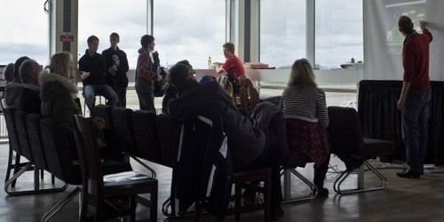



### Cheapjack is Ross Dalziel, an artist and researcher who sets up activity, events & makes systems to explore how knowledge is produced and shared. 

**I explore how research & knowledge is produced; who makes it, receives it, where and how they make it and for who's benefit.**

I usually put together events, systems and situations that explore this. I bring people from different disciplines together to make things happen. Often I do this in the context of a form of 'art-science' or in 'maker' culture.  I'm sometimes based at the makerspace/co-working space [DoESLiverpool](https://doesliverpool.com/) in Liverpool and co-founder of the art collective [Domestic Science](https://domesticscience.org.uk/) who make playful spaces to explore technoscience and the domestic.

Ultimately I'm concerned with critique, strategy and tactics in collective knowledge production and practice.

I've worked with all kinds of people: Artists, Activists, Academics, Amateur Astronomers, Amateur Radio Operators, Artists, Biologists, Canoeing clubs, Chemical Factory Employees, Computer engineers, Decap Organ Restorers, Hackspaces, Makers, Musicians, NHS staff, Nintendo DS Owners, Philosophers, Physiotherapists, Planespotters, Sailors, Social and Political Scientists.

I've done this for organisations like AND Festival, Arts Council England, FACT, Halton Borough Council, Laznia Centre for Contemporary Art, Liverpool Biennial, National Museums Liverpool, Octopus Collective, PRS for Music Foundation, SoundNetwork, Tate Liverpool, The Crafts Council, Ultima Contemporary Music Oslo and Urbane Kunst Ruhr. I currently work at the [Neuromuscular Centre](https://www.nmcentre.com/) a social enterprise and charity for people living with Neuromuscular conditions like my own and teach Fine Art Fundamentals at [Lancaster University](https://www.lancaster.ac.uk/lica/), where I am a PhD candidate at [LICA](https://www.lancaster.ac.uk/lica/) and the [Faculty of Health and Medicine](https://www.lancaster.ac.uk/health-and-medicine/) and a member of the [Centre For Science Studies](https://wp.lancs.ac.uk/sciencestudies).

## Recent Posts

<ul class="posts">
  
    <li>{{ post.date | date_to_string }} &raquo; <a href="{{ BASE_PATH }}{{ post.url }}">{{ post.title }}</a></li>
  
</ul>

## My github

Find my stuff on [github](https://github.com/cheapjack)

## Domestic Science
[Collaborations around 'domestic' knowledge](http://domesticscience.org.uk)

## My Project Archive
[Project Archive](/pages.html)

## My Blog Archive
[Blog Archive](/archive.html)

## Get in Touch
Tweet me [@cheapjack](https://twitter.com/cheapjack)

## Speculative Ideas
[Feed of throwaway and partly serious ideas](https://feeds.pinboard.in/rss/u:cheapjack/t:notimenobudget)

## My Old Blogs
[Thinking & quoting](http://cheapjack.tumblr.com)
[ArtJelly](http://artjelly.tumblr.com)

